<div align="center">



[](https://tylr.space)

</div>

---

### 💾  About This Macintosh

```
╔══════════════════════════════════════════════════╗
║                                                  ║
║   Owner          tyler                           ║
║   Site           tylr.space                      ║
║   Built with     HTML · CSS · JS · vibes         ║
║   System         Mac OS 9.2.2                    ║
║   Disk           ▓▓▓▓▓▓▓▓▓▓▓▓░░░  79% used       ║
║                                                  ║
╚══════════════════════════════════════════════════╝
```

### 📂  Open

- **[tylr.space](https://tylr.space)** — portfolio, Mac OS 9 themed
- Pinned repos below ↓

<br />

<div align="center">
<sub>` chime ` — booted 1999. still running.</sub>
</div>
